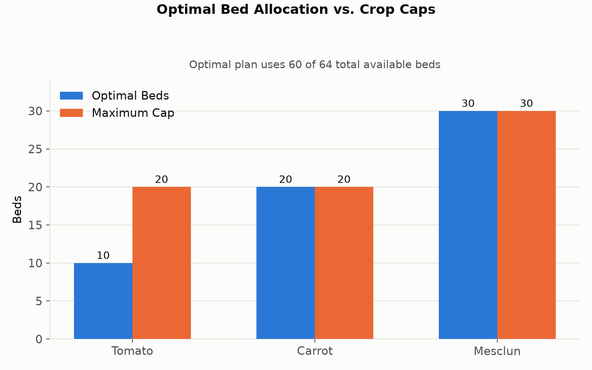
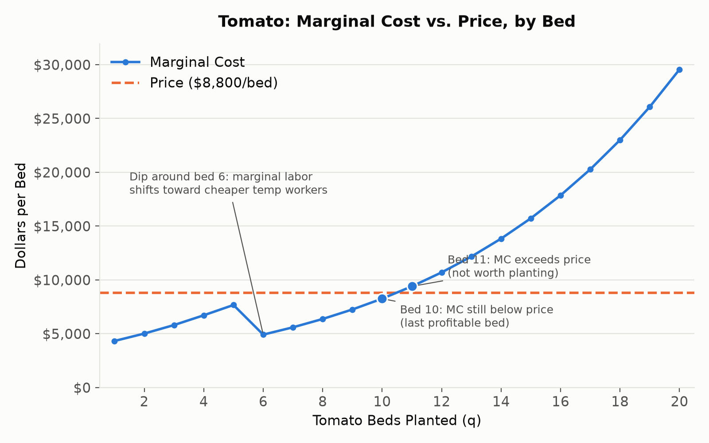

# Perfect Competition Farm Planning Analysis

When I first sat down with this model, my instinct was to check whether the plan made sense bed by bed rather than just trust the output. That's where the tomato numbers turned out to matter most.

Tomatoes bring in $8,800 per bed ('MC - Tomato'!M16 in model.xlsx), and that's the number every other bed gets compared against. At bed 10, marginal cost is about $8,249 ('MC - Tomato'!L16), still below the $8,800 price, so that bed is still profitable at the margin. At bed 11, marginal cost jumps to about $9,391 ('MC - Tomato'!L17), now above the price, so that bed isn't worth planting. Bed 10 is basically where price and marginal cost meet, close enough to call it the profit-maximizing stopping point, even though the two numbers aren't perfectly equal.

Both carrots and mesclun are maxed out, as Figure 1 shows, carrots at 20 of 20 beds and mesclun at 30 of 30, so these are the caps actually limiting the plan. $405.05 for carrots ('MC - Carrot'!O26) and $279.90 for mesclun ('MC - Mesclun'!O36) show me the margin between price and marginal cost for the last bed we're already allowed to plant, which is 20 carrot beds and 30 mesclun beds. The published $352.49 for carrots and $246.47 for mesclun are a little different because they show what we would actually gain if we were allowed to plant one more bed of each crop. As for the other two potential constraints, total beds at 64 aren't binding, we have room there. Based on the math, we only need about 3.16 workers' worth of temporary labor, even though we'd need to hire four whole workers. Since we aren't using all of the labor capacity already available, having access to another temporary worker wouldn't increase profit.

*Figure 1. Optimal bed allocation compared with each crop's maximum bed cap (Optimization!B7:C10 in model.xlsx: 10 tomato / 20 carrot / 30 mesclun, 60 of 64 beds used).*

Farmer labor costs $34.72 an hour (Inputs!B8 in model.xlsx), while temp labor is much cheaper at $17.36 an hour (Inputs!B11). The shift starts at bed 5, when we need about 724.73 labor hours ('MC - Tomato'!B11), which puts us just over the farmer's 720-hour limit and means we have to start using temp labor. By bed 6, we're using about 236.64 hours of cheaper temp labor ('MC - Tomato'!D12), which is enough to bring marginal cost down from $7,660.86 at bed 5 ('MC - Tomato'!L11) to $4,906.28 ('MC - Tomato'!L12). But that dip doesn't last long. Labor requirements are still compounding at 10 percent per bed, so eventually the extra labor we need outweighs what we're saving with cheaper temp workers, and marginal cost starts climbing again. That's what creates the dip in the curve shown in Figure 2.

*Figure 2. Tomato marginal cost compared with the $8,800 market price per bed.*

Fixed cost is paid regardless, so what really matters is whether the price covers the average variable cost. In our model, carrots have an average variable cost of $1,918.45, calculated as ('MC - Carrot'!K26 − Inputs!B6) ÷ 'MC - Carrot'!A26, compared with a price of $2,094 ('MC - Carrot'!M26), while mesclun has an average variable cost of $2,430.74, calculated as ('MC - Mesclun'!K36 − Inputs!B6) ÷ 'MC - Mesclun'!A36, compared with a price of $2,700 ('MC - Mesclun'!M36). Since we're bringing in more per bed than we're spending on the variable costs for both crops, it still makes sense to plant them because they're helping cover fixed costs we'd be paying either way.

My original guess was 20 tomatoes, 20 carrots, 24 mesclun. The model landed on 10, 20, 30. I was right that carrots would max out, but wrong about tomatoes and mesclun. Before I even built the model, I said I'd be wrong if it came in below 17 tomato beds. It landed on 10, so by my own standard I was clearly wrong about tomatoes. I knew tomato labor compounded at 10 percent, but I underestimated how much that would drag marginal cost up as beds increased. I also assumed all 64 beds should be used, but the optimal plan only uses 60. That's the real lesson here, filling every bed isn't the same as maximizing profit.
