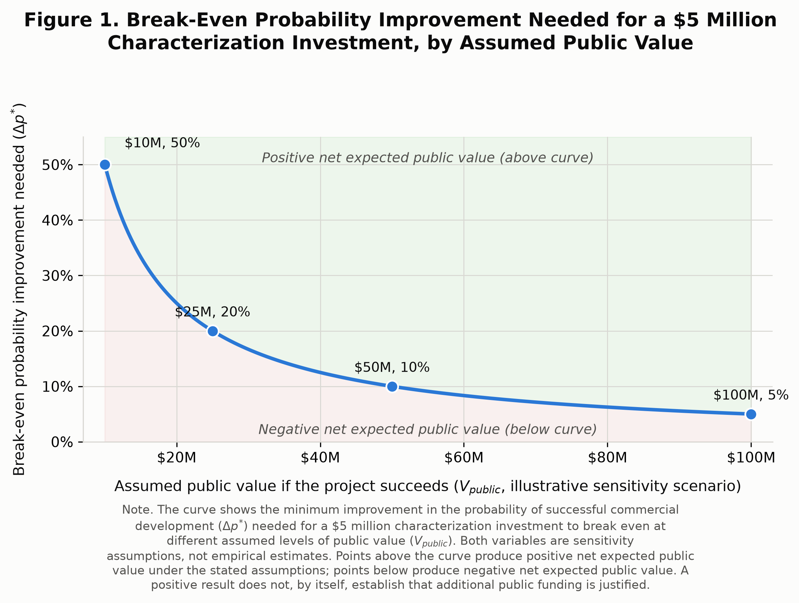

# Should Hawaiʻi Keep Funding Geothermal Resource Characterization?

Hawaiʻi has already put $5 million into characterizing geothermal resources on Maui through slim-hole drilling, subsurface and water testing, data analysis, updated conceptual models, and recommendations (Hawaiʻi State Energy Office [HSEO], n.d.; Hawaiʻi Department of Business, Economic Development & Tourism [DBEDT], 2025). Because the current program—funded by Governor Green's 2024 allocation of federal relief funds—runs through December 2026, any comparable next round would be a new appropriation decision for the Hawaiʻi State Legislature (HSEO, n.d.; DBEDT, 2025). With the current program still producing information, the question for the state's next funding decision is whether another comparable investment would create enough public value to justify its cost.

My recommendation is to finish and evaluate the current program before committing another $5 million. If the results justify more investment, future funding should require accessible, reusable information and transparent reporting on who receives the resulting public value.

## What $5 Million Actually Buys

This money is not building a power plant; it is buying information about the resource. That information has economic value because geothermal development requires substantial exploration spending while major questions remain unresolved. Better information can improve development decisions, including whether to walk away. I also recognize that characterization can create value by helping developers avoid spending money on unsuccessful drilling. Some of those savings could also benefit the public through lower electricity costs or reduced public spending. However, I chose not to include them in my model because I don’t think there’s enough evidence to determine how much of those savings would actually reach the public.

There is also a spillover when publicly funded information is not locked up with one company. The Department of Energy's Geothermal Data Repository provides public access to data from DOE-funded geothermal projects (U.S. Department of Energy [DOE], n.d.). I view that structure as a public-good benefit because the information can be reused beyond whoever funded it first. But I found no evidence that Hawaiʻi's private developers systematically underinvest in characterization. High costs and uncertainty alone do not prove a market failure, so the current program does not automatically justify another round.

## What Would Have to Be True for a Second $5 Million to Pay Off?

The two key unknowns are how much public characterization improves the probability of successful commercial development (Δp) and the public value created if development succeeds (V_public). Because neither can be estimated confidently for Maui, I use sensitivity analysis rather than a single forecast:

**Expected public value from characterization = Δp × V_public**

**Net expected public value = (Δp × V_public) − $5 million**

**Break-even Δp\* = $5 million / V_public**

At assumed public values of $10 million, $25 million, $50 million, and $100 million, Figure 1 shows that characterization must improve the probability of success by 50, 20, 10, and 5 percentage points, respectively, to break even. These are sensitivity assumptions, not estimates of a Maui project's value or the actual effect of characterization.

I found no Hawaiʻi-specific estimate of how much public characterization improves the odds of commercial development. Evidence that a geothermal resource exists is not the same as evidence about Δp, and the broader literature shows substantial uncertainty in geothermal exploration and even how "success" is defined (Wall & Dobson, 2016; Witter et al., 2019). The model therefore shows what would have to be true for another $5 million to break even without manufacturing precision the evidence cannot support.

## Who Actually Gets the Value?

V_public also requires care. Private developer revenue does not automatically flow to taxpayers, so I exclude it. Potential public value instead includes royalties, avoided fossil-fuel or ratepayer costs, avoided emissions damage, and energy security. Converting those benefits into one Maui-specific dollar estimate would require assumptions about a project that does not yet exist, which is why I test a range of V_public values.

Distribution matters because economic value and who captures it are different questions. State law allocates a county share of geothermal royalties (Haw. Rev. Stat. § 182-7(c), 2025). On Hawaiian home lands, the state Attorney General determined that geothermal royalties go to the Department of Hawaiian Home Lands under the Hawaiian Homes Commission Act (Department of Hawaiian Home Lands [DHHL], 2014). Hawaiʻi County has also directed geothermal royalty revenue toward relocation and community benefits in Lower Puna (County of Hawaiʻi, 2024). These examples do not determine how a hypothetical Maui project's benefits would be divided; land tenure and project structure would matter.

## Recommendation

The current $5 million is already committed, so the next funding decision should be marginal: does another $5 million produce expected public benefits greater than its cost? I do not think the available evidence answers that yet.

Waiting has an opportunity cost because another round could accelerate information, development, and future public benefits. Committing early has an opportunity cost too: it spends another $5 million before the current program has reduced the uncertainty we are already paying it to investigate. Because those results should improve the next decision, I think the value of waiting for that information outweighs the case for committing another round now.

I don't think the evidence lets me credibly place V_public anywhere within the $10 million–$100 million range Figure 1 tests, so I can't identify the break-even Δp the Legislature should actually be looking for. That unresolved uncertainty is itself part of why I think the current program should be finished and evaluated before another comparable $5 million is committed.

If the results support continuing, I would attach two conditions. First, publicly funded characterization should produce accessible and reusable information. The current program promises analysis and a published report, but the materials I reviewed do not establish whether the underlying data will be broadly available (DBEDT, 2025; HSEO, n.d.). Broader reuse strengthens the public-good case; a private information advantage weakens it.

Second, future funding should transparently report the public value created and how it is distributed. If public investment is justified through royalties, lower energy costs, energy security, environmental benefits, or community benefits, policymakers and taxpayers should be able to see whether those benefits materialize and who receives them, while preserving existing legal arrangements for Hawaiian home lands.

## Conclusion

A second $5 million investment could break even under plausible combinations of Δp and V_public, but the evidence does not establish that those conditions currently hold. Hawaiʻi should finish and evaluate the current program first. If further characterization is justified, future funding should keep the information broadly useful and make the resulting public value transparent.

# Figure 1

*Break-Even Probability Improvement Needed for a $5 Million Characterization Investment, by Assumed Public Value*

# References

County of Hawaiʻi. (2024). *Annual comprehensive financial report for the fiscal year ended June 30, 2024.* https://records.hawaiicounty.gov/weblink/1/edoc/150340/2024-COH%20-%20Annual%20Comprehensive%20Financial%20Report.pdf

Department of Hawaiian Home Lands. (2014). *AG opinion: Geothermal proceeds on DHHL lands.* https://dhhl.hawaii.gov/2014/03/18/7897/

Haw. Rev. Stat. § 182-7(c) (2025). https://www.capitol.hawaii.gov/hrscurrent/vol03_ch0121-0200d/HRS0182/HRS_0182-0007.htm

Hawaiʻi Department of Business, Economic Development & Tourism. (2025). *Report on non-general fund information to the 2026 Legislature: Appropriation account S-276-B.* https://files.hawaii.gov/dbedt/annuals/2025/2026-aso-non-general-fund-report.pdf

Hawaiʻi State Energy Office. (n.d.). *Geothermal.* Retrieved September 25, 2026, from https://energy.hawaii.gov/geothermal/

U.S. Department of Energy. (n.d.). *Geothermal Data Repository.* Retrieved September 27, 2026, from https://gdr.openei.org/about

Wall, A. M., & Dobson, P. F. (2016). Refining the definition of a geothermal exploration success rate. *Proceedings of the 41st Workshop on Geothermal Reservoir Engineering.* https://pangea.stanford.edu/ERE/pdf/IGAstandard/SGW/2016/Wall2.pdf

Witter, J. B., Trainor-Guitton, W. J., & Siler, D. L. (2019). Uncertainty and risk evaluation during the exploration stage of geothermal development: A review. *Geothermics, 78*, 233–242. https://www.sciencedirect.com/science/article/abs/pii/S0375650518303183
